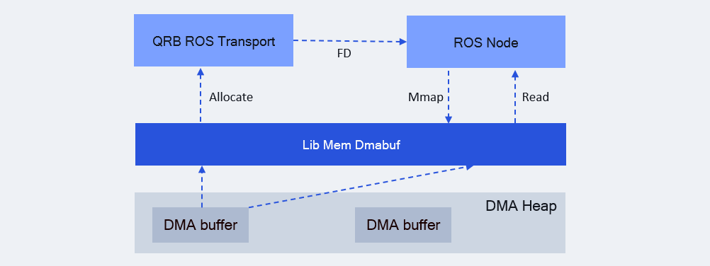

<div align="center">
  <h1>Lib Mem Dmabuf</h1>
  <p align="center">
  </p>
  <p>A Library for interacting with Linux DMA buffers</p>

  <a href="https://ubuntu.com/download/qualcomm-iot" target="_blank"></a>
  <a href="https://docs.ros.org/en/jazzy/" target="_blank"></a>

</div>

---

## 👋 Overview

[lib_mem_dmabuf](https://github.com/qualcomm-qrb-ros/lib_mem_dmabuf) is a userspace library package for interacting with Linux DMA buffers. It provides:

* C++ APIs and Ament CMake build integration, make it easy to use in ROS 2 projects.
* Importing and accessing underlying file descriptors (fd).
* Flexible buffer management with automatic or manual release.
* Support for buffer release callback registration.

> [!NOTE]
> Prerequisite: Linux kernel version 5.12 or later is required for kernel dma-buf support.

<div align="center">
  
</div>

<br>

`lib_mem_dmabuf` allocates DMA buffer from Linux DMA heaps, and exports file descriptor(fd).

The `fd` can be `mmap` from userspace, this enables zero-copy access between different software modules.

## 🔎 Table of contents
  * [APIs](#-apis)
  * [Supported targets](#-supported-targets)
  * [Installation](#-installation)
  * [Usage](#-usage)
  * [Build from source](#-build-from-source)
  * [Contributing](#-contributing)
  * [Contributors](#%EF%B8%8F-contributors)
  * [License](#-license)

## ⚓ APIs

| Function                                                     | Description                             | Parameters                                                   | Return Value              |
| ------------------------------------------------------------ | --------------------------------------- | ------------------------------------------------------------ | ------------------------- |
| DmaBuffer::DmaBuffer(int fd, std::size_t size)               | Constructor for DmaBuffer class         | fd: dma-buf file descriptor, size: dma-buf size              | DmaBuffer object          |
| static std::shared_ptr\<DmaBuffer\> <br>alloc(std::size_t size, const std::string& heap_name) | Alloc dmabuf with size and heap name    | size: buffer size (bytes), heap_name: dmabuf heap name       | Allocated buffer pointer  |
| bool DmaBuffer::release()                                    | Release dmabuf                          | /                                                            | Success or not            |
| bool DmaBuffer::map()                                        | Description                             | /                                                            | Success or not            |
| bool DmaBuffer::unmap()                                      | Description                             | /                                                            | Success or not            |
| bool DmaBuffer::sync_start()                                 | Description                             | /                                                            | Success or not            |
| bool DmaBuffer::sync_end()                                   | Description                             | /                                                            | Success or not            |
| bool DmaBuffer::set_auto_release(bool auto_release)          | Set auto release dmabuf fd when destroy | auto_release: whether to auto release fd when Dmabuf object destroy | Success or not            |
| void DmaBuffer::set_destroy_callback(<br>std::function<void(std::shared_ptr\<DmaBuffer\>)> cb) | Set destroys callback function          | cb: callback function when dmabuf destroy                    |                           |
| bool DmaBuffer::set_data(<br>void* data, std::size_t size, std::size_t offset = 0) | Set data into dmabuf                    | data: data to be saved, size: data size, offset: offset into dma-buf address | Success or not            |
| int DmaBuffer::fd() const                                    | Get dmabuf fd                           | /                                                            | Dmabuf file descriptor    |
| int DmaBuffer::size() const                                  | Get dmabuf size                         | /                                                            | Dmabuf size               |
| void* DmaBuffer::addr()                                      | Get dmabuf CPU memory mapped address    | /                                                            | Dmabuf CPU mapped address |


## 🎯 Supported targets

<table >
  <tr>
    <th>Development Hardware</th>
    <td>Qualcomm Dragonwing™ RB3 Gen2</td>
    <td>Qualcomm Dragonwing™ IQ-9075 EVK</td>
  </tr>
  <tr>
    <th>Hardware Overview</th>
    <th><a href="https://www.qualcomm.com/developer/hardware/rb3-gen-2-development-kit"></a></th>
    <th><a href="https://www.qualcomm.com/products/internet-of-things/industrial-processors/iq9-series/iq-9075"></a></th>
  </tr>
</table>

---

## ✨ Installation

> [!IMPORTANT]
> **PREREQUISITES**: The following steps need to be run on **Qualcomm Ubuntu** and **ROS Jazzy**.<br>
> Refer to [Install Ubuntu on Qualcomm IoT Platforms](https://ubuntu.com/download/qualcomm-iot) and [Install ROS Jazzy](https://docs.ros.org/en/jazzy/index.html) to setup environment. <br>
> For Qualcomm Linux, please check out the [Qualcomm Intelligent Robotics Product SDK](https://docs.qualcomm.com/bundle/publicresource/topics/80-70018-265/introduction_1.html?vproduct=1601111740013072&version=1.4&facet=Qualcomm%20Intelligent%20Robotics%20Product%20(QIRP)%20SDK) documents.

Add Qualcomm IOT PPA for Ubuntu:

```bash
sudo add-apt-repository ppa:ubuntu-qcom-iot/qcom-noble-ppa
sudo add-apt-repository ppa:ubuntu-qcom-iot/qirp
sudo apt update
```

Install Debian package:

```bash
sudo apt install ros-jazzy-lib-mem-dmabuf
```

## 🚀 Usage

This section shows how to use `lib_mem_dmabuf` to interact with Linux DMA buffers in your projects.

Add the dependencies in your `package.xml`:

```xml
<depend>lib_mem_dmabuf</depend>
```

Configure dependencies in your `CMakeLists.txt`:

```cmake
find_package(ament_cmake_auto REQUIRED)
ament_auto_find_build_dependencies()
```

Allocate a DMA buffer using the C++ APIs:

```c++
#include "lib_mem_dmabuf/dmabuf.hpp"

// Allocate dmabuf with size and DMA heap name
auto buf = lib_mem_dmabuf::DmaBuffer::alloc(1024, "/dev/dma_heap/system");

// Get the file descriptor of the buffer
std::cout << "fd: " << buf->fd() << std::endl;

// Get the CPU-accessible address
if (buf->map()) {
    std::cout << "CPU address: " << buf->addr() << std::endl;
}

// The fd will be automatically closed when buf goes out of scope
```

---

## 👨‍💻 Build from source

### Dependencies
Install dependencies `ros-dev-tools`:
```shell
sudo apt install ros-dev-tools
```

### Build
Download the source code and build it with colcon
```bash
source /opt/ros/jazzy/setup.bash
git clone https://github.com/qualcomm-qrb-ros/lib_mem_dmabuf.git
colcon build
```

## 🤝 Contributing

We love community contributions! Get started by reading our [CONTRIBUTING.md](CONTRIBUTING.md).<br>
Feel free to create an issue for bug report, feature requests or any discussion💡.

## ❤️ Contributors

Thanks to all our contributors who have helped make this project better!

<table>
  <tr>
    <td align="center"><a href="https://github.com/penww"><br /><sub><b>penww</b></sub></a></td>
    <td align="center"><a href="https://github.com/jiaxshi"><br /><sub><b>jiaxshi</b></sub></a></td>
  </tr>
</table>

## 📜 License

Project is licensed under the [BSD-3-Clause](https://spdx.org/licenses/BSD-3-Clause.html) License. See [LICENSE](./LICENSE) for the full license text.
